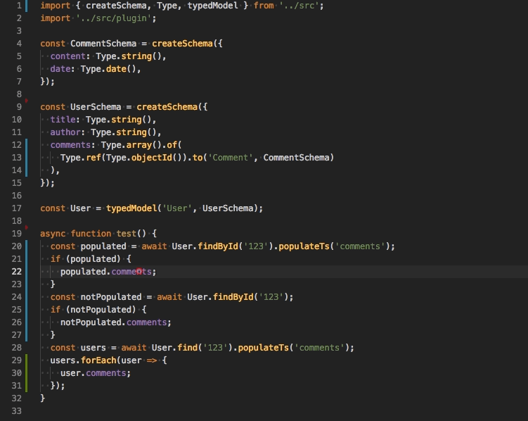
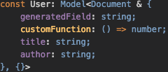

# ts-mongoose

Automatically infer TypeScript interfaces from mongoose schemas.

[](https://travis-ci.org/BetterCallSky/ts-mongoose) [](https://www.npmjs.org/package/ts-mongoose)

## Installation

```bash
npm i ts-mongoose mongoose @types/mongoose
yarn add ts-mongoose mongoose @types/mongoose
```

## The Problem
When using mongoose and Typescript, you must define schemas and interfaces. Both definitions must be maintained separately and must match each other. It can be error-prone during development and cause overhead.  
  
`ts-mongoose` is a very lightweight library that allows you to create a mongoose schema and a typescript type from a common definition.  
All types as created from 1-liner functions and does not depend on decorators❗️.
  
For example:  
`Type.string()` returns `{type: String, required: true}`, which is the same definition required in the original mongoose library.

## Example

Before:

```ts
import { Schema, model, Model, Document } from 'mongoose';

const AddressSchema = new Schema({
  city: { type: String, required: true },
  country: String,
  zip: String,
});

const PhoneSchema = new Schema({
  phoneNumber: { type: Schema.Types.Number, required: true },
  name: String
})

const UserSchema = new Schema({
  title: { type: String, required: true },
  author: { type: String, required: true },
  body: { type: String, required: true },
  comments: [
    {
      body: { type: String, required: true },
      date: { type: Date, required: true },
    },
  ],
  date: { type: Date, default: Date.now, required: true },
  hidden: { type: Boolean, required: true },
  meta: {
    votes: { type: Schema.Types.Number },
    favs: { type: Schema.Types.Number },
  },
  m: {
    type: Schema.Types.Mixed,
    required: true,
  },
  otherId: {
    type: Schema.Types.ObjectId,
    required: true,
  },
  address: {
    type: AddressSchema,
    required: true,
  },
  phones: {
    type: [PhoneSchema],
    required: true,
  },
});

interface UserProps extends Document {
  title: string;
  author: string;
  body: string;
  // Duplicate all props from the above schema :(
}

const User: Model<UserProps> = model('User', UserSchema);

```

🎉🎉🎉 After:

```ts
import { createSchema, Type, typedModel } from 'ts-mongoose';

const AddressSchema = createSchema({
  city: Type.string(),
  country: Type.optionalString(),
  zip: Type.optionalString(),
}, { _id: false });

const PhoneSchema = createSchema({
  phoneNumber: Type.number(),
  name: Type.optionalString(),
});

const UserSchema = createSchema({
  title: Type.string(),
  author: Type.string(),
  body: Type.string(),
  comments: Type.array().of({
    body: Type.string(),
    date: Type.date(),
  }),
  date: Type.date({ default: Date.now as any }),
  hidden: Type.boolean(),
  meta: Type.object().of({
    votes: Type.number(),
    favs: Type.number(),
  }),
  m: Type.mixed(),
  otherId: Type.objectId(),
  address: Type.schema().of(AddressSchema),
  phones: Type.array().of(PhoneSchema),
});

const User = typedModel('User', UserSchema);
User.findById('123').then(user => {
  if (user) {
    user. // autocomplete here
  }
});
```


### API
- Each type has two forms: required and optional
```ts
{
  // same as {type: String}
  firstName: Type.optionalString(),
  // same as {type: String, required: true}
  email: Type.string(),
}
```
- Each type accepts the same options from mongoose
```ts
{
  // same as {type: String, required: true, unique: true, index: true}
  email: Type.string({unique: true, index: true})
}
```
- `schema`, `object`, `array` types have a method `of` where you must provide a child type
```ts
{
  // same as {type: [String], required: true}
  tags: Type.array().of(Type.string())
}
```
- `schema.of(ExampleSchema)` has typical for Subdocument additional fields and methods. Setting `{ _id: false }` in SchemaOptions won't attach `_id` property in Subdocument
```ts
const AddressSchema = createSchema({city: Type.string()}, { _id: false });
{
  // same as {type: AddressSchema}
  address: Type.schema().of(AddressSchema)
}
// address property has city property, other Subdocument methods and properties except '_id'
```
- `array.of(ExampleSchema)` will return DocumentArray instead of standard array
```ts
const PhoneSchema = createSchema({phoneNumber: Type.number()}, { _id: false });
{
  // same as {type: [PhoneSchema]}
  phones: Type.schema().of(PhoneSchema)
}
// phones property has such methods as create(), id(), but also those typical for arrays like map(), filter() etc
```
- `ref` is a special type for creating references
```ts
{
  // same as [{type: Schema.Types.ObjectId, ref: 'Comment'}]
  comments: Type.array().of(
    Type.ref(Type.objectId()).to('Comment', CommentSchema)
  ),
}
```
- `populateTs(property: string)` use this function to populate a property and adjust the returned type automatically. Under the hood it calls only the native `populate` method.  
Method will be available if you import a special plugin.
```ts
// models.ts

import 'ts-mongoose/plugin'

User.find().populateTs('comments');

```

## Extracting Document type

Use `ExtractDoc` to extract generated document type.  
Use `ExtractProps` to extract generated base model properties.  
Example:

```ts
import { createSchema, Type, typedModel, ExtractDoc, ExtractProps } from 'ts-mongoose';

export const UserSchema = createSchema({
  email: Type.string(),
  username: Type.string(),
  isBlocked: Type.optionalBoolean(),
});

export const User = typedModel('User', UserSchema);
export type UserDoc = ExtractDoc<typeof UserSchema>;
export type UserProps = ExtractProps<typeof UserSchema>;


// example function 

async function blockUser(user: UserDoc) {
  user.isBlocked = true;
  // access all properties + Document methods and properties
  await user.save();
}

function randomUser(): UserProps {
  // must return `email`, `username`
  // `isBlocked` is optional
  return {
    email: 'user1@example.com',
    username: 'user1',
  }
}

```

## Refs
Refs and populations are supported.  
Check code under `example/example4.ts`.  





### Custom Field
If you need to specify custom fields in the model, you can add a fake annotation.  
It's only required if you add virtual fields or custom methods to the model.

```ts
const UserSchema = createSchema({
  title: Type.string(),
  author: Type.string(),
  ...({} as {
    generatedField: string;
    customFunction: () => number;
  }),
});
const User = typedModel('User', UserSchema);
```
Autocomplete popup:  



### TODO
- support types: Decimal128, Map

MIT